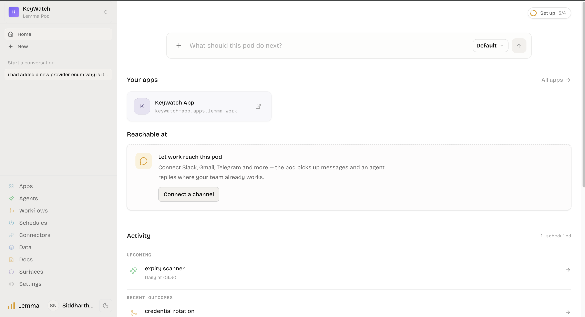
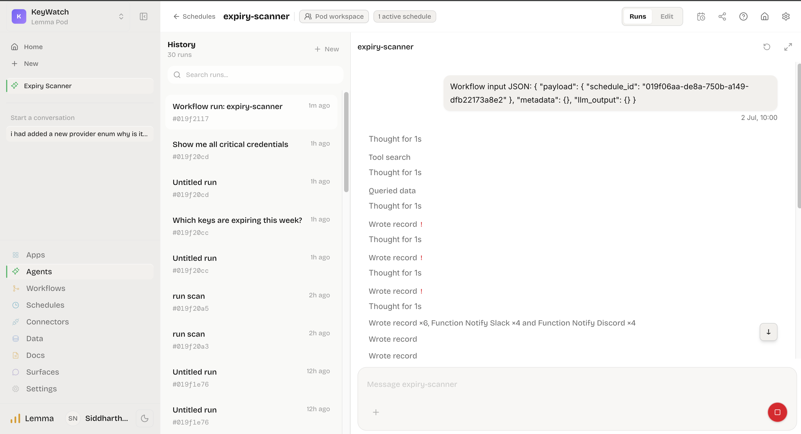
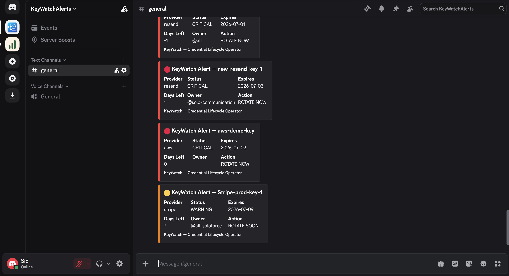

# KeyWatch

KeyWatch is a credential lifecycle management pod built on [Lemma](https://lemma.ai). It tracks API key expiry dates across providers (Stripe, Resend, GitHub), runs a daily scan to classify urgency, fires alerts to Slack and Discord for credentials approaching expiration, and provides a human-in-the-loop rotation workflow.

Lemma Dashboard


Scheduler - Runs Everyday at 10AM IST


Discord - Sceheduler Message


## What it does

- **Daily scan** — at 04:30 UTC (10 AM IST), the `expiry-scanner` agent queries every credential, calculates days until expiry, and classifies each as `critical` (≤ 2 days), `warning` (3–7 days), or `active` (> 7 days).
- **Dual-channel alerts** — for every critical/warning credential, rich notifications are posted to both Slack (Block Kit) and Discord (embeds) with provider, status, expiry date, days remaining, and owner.
- **Audit trail** — every scan event and notification is recorded in `audit_log` with full context (action, triggered_by, old/new expiry, slack_notified).
- **Rotation workflow** — a manual, approval-gated workflow lets an operator enter a credential name, receive Slack and Discord pre-notifications, and approve or reject rotation — all tracked in the audit log.
- **Chat interface** — the `expiry-scanner` agent can answer ad-hoc questions about credential status without performing any writes.

---

## Architecture

```
┌──────────────────────────────────────────────────────────────────┐
│  Schedule: daily-expiry-scan  (cron: 30 4 * * *)                 │
│                 │                                                │
│                 ▼                                                │
│  Agent: expiry-scanner ──reads/writes──► Table: credentials      │
│                 │                                                │
│                 ├──creates──────────────► Table: audit_log       │
│                 │                                                │
│                 ├──calls────────────────► Function: notify_slack  │
│                 │                                 │              │
│                 │                                 └──POST──► Slack│
│                 │                                                │
│                 └──calls────────────────► Function: notify_discord│
│                                                  │              │
│                                                  └──POST──► Discord
│                                                                  │
│  Workflow: credential-rotation (manual trigger)                  │
│    FORM → Function: check_credential                             │
│         → Function: notify_slack                                 │
│         → Function: notify_discord                               │
│         → FORM (approval)                                        │
│         → END                                                    │
└──────────────────────────────────────────────────────────────────┘
```

---

## Pod structure

```
keywatch/
├── agents/
│   └── expiry-scanner/
│       ├── expiry-scanner.json     # Agent definition & permissions
│       └── instruction.md          # System prompt / behavioral spec
├── functions/
│   ├── check_credential/
│   │   ├── check_credential.json   # Function manifest
│   │   └── code.py                 # Looks up a credential by name
│   ├── notify_slack/
│   │   ├── notify_slack.json       # Function manifest
│   │   └── code.py                 # Posts Block Kit messages to Slack
│   └── notify_discord/
│       ├── notify_discord.json     # Function manifest
│       └── code.py                 # Posts embed messages to Discord
├── tables/
│   ├── credentials/
│   │   └── credentials.json        # Schema: API key registry
│   ├── audit_log/
│   │   └── audit_log.json          # Schema: immutable event log
│   └── webhook_config/
│       └── webhook_config.json     # Schema: webhook URL key-value store
├── workflows/
│   └── credential-rotation/
│       └── credential-rotation.json  # DAG for manual rotation
└── schedules/
    └── daily-expiry-scan/
        └── daily-expiry-scan.json  # Cron trigger for expiry-scanner
```

---

## Data model

### `credentials`

| Column            | Type            | Notes                                                                    |
| ----------------- | --------------- | ------------------------------------------------------------------------ |
| `id`              | PK              | Auto-generated primary key                                               |
| `name`            | TEXT (required) | Human-readable credential name                                           |
| `provider`        | ENUM            | `stripe` \| `resend` \| `github`                                         |
| `key_hint`        | TEXT            | Last few characters of the key (display only — never store the full key) |
| `expiry_date`     | DATE (required) | When the credential expires                                              |
| `status`          | ENUM            | `active` \| `warning` \| `critical` \| `rotated`                         |
| `last_rotated`    | DATE            | Date of last rotation                                                    |
| `vault_reference` | TEXT            | Reference ID in an external secrets vault                                |
| `owner_slack`     | TEXT            | Slack handle of the credential owner (e.g. `@alice`)                     |
| `notes`           | TEXT            | Free-form notes                                                          |

### `audit_log`

| Column            | Type            | Notes                                                                 |
| ----------------- | --------------- | --------------------------------------------------------------------- |
| `id`              | PK              | Auto-generated primary key                                            |
| `credential_name` | TEXT (required) | Name of the affected credential                                       |
| `provider`        | ENUM            | Same enum as `credentials.provider`                                   |
| `action`          | TEXT (required) | e.g. `slack_notified`, `discord_notified`, `rotated`, `scan_detected` |
| `triggered_by`    | TEXT (required) | Who/what caused the event                                             |
| `old_expiry`      | DATE            | Expiry before rotation                                                |
| `new_expiry`      | DATE            | Expiry after rotation                                                 |
| `slack_notified`  | BOOLEAN         | Whether Slack was successfully notified                               |
| `notes`           | TEXT            | Free-form context                                                     |

Records are only ever **created**, never updated — the audit log is append-only.

### `webhook_config`

| Column  | Type            | Notes                                                       |
| ------- | --------------- | ----------------------------------------------------------- |
| `id`    | PK              | Auto-generated primary key                                  |
| `key`   | TEXT (required) | Config key, e.g. `slack_webhook_url`, `discord_webhook_url` |
| `value` | TEXT (required) | The webhook URL                                             |

Webhook URLs are stored here rather than hardcoded, so they can be updated without redeploying functions.

---

## Components

### Agent: `expiry-scanner`

The core intelligence of the pod. Operates in two modes:

**Scan mode** (triggered by schedule or `"run scan"`)

1. Queries all credentials using `(expiry_date - CURRENT_DATE)` for accurate day calculation
2. Classifies: `critical` (≤ 2 days), `warning` (3–7 days), `active` (> 7 days)
3. Updates the `status` field on each credential record
4. Creates an `audit_log` entry for each critical/warning credential
5. Calls `notify_slack` **and** `notify_discord` for each critical/warning credential
6. Responds with a formatted scan summary

**Chat mode** (all other messages)
Read-only. Answers questions about credential status without performing any writes.

**Scan summary format:**

```
Scan Summary — 2026-07-02
🔴 Critical (< 2 days): 1
🟡 Warning (2-7 days): 0
🟢 Active (> 7 days): 6

Name / Provider / Expires / Days left / Action
```

**Permissions:** read + write on `credentials` and `audit_log`; read on `webhook_config`; execute on `notify_slack` and `notify_discord`.

---

### Function: `notify_slack`

Posts a Slack Block Kit message via webhook. The webhook URL is read from `webhook_config` (key: `slack_webhook_url`). Supports two message types:

- **`alert`** (default) — fires for `critical` or `warning` credentials. Includes provider, status, expiry, days left, owner, and a call-to-action (`ROTATE NOW` or `ROTATE SOON`). Returns early without posting if the credential is `active`.
- **`rotated`** — fires after a successful manual rotation to confirm the new state.

After a successful post, the function creates an `audit_log` record marking the notification.

**Input:**

```json
{
	"credential_name": "my-stripe-key",
	"message_type": "alert"
}
```

**Output:**

```json
{
	"ok": true,
	"message": "Slack notification sent successfully"
}
```

---

### Function: `notify_discord`

Posts a Discord embed message via webhook. The webhook URL is read from `webhook_config` (key: `discord_webhook_url`). Mirrors `notify_slack` in behavior and message types:

- **`alert`** — color-coded embed (red for critical, orange for warning) with provider, status, expiry, days left, owner, and urgency label.
- **`rotated`** — green embed confirming the credential was successfully rotated.

After a successful post, the function creates an `audit_log` record.

**Input:**

```json
{
	"credential_name": "my-stripe-key",
	"message_type": "alert"
}
```

**Output:**

```json
{
	"ok": true,
	"message": "Discord notification sent successfully"
}
```

---

### Function: `check_credential`

Point lookup for a single credential by name. Used by the rotation workflow to validate that a credential exists before proceeding.

**Input:**

```json
{
	"credential_name": "my-stripe-key"
}
```

**Output:**

```json
{
	"found": true,
	"credential_name": "my-stripe-key",
	"provider": "stripe",
	"expiry_date": "2026-07-01",
	"days_left": 3,
	"status": "warning",
	"owner_slack": "@alice"
}
```

---

### Workflow: `credential-rotation`

A manually triggered, human-in-the-loop workflow for rotating a credential.

**Steps:**

1. **Intake form** — operator enters the `credential_name`
2. **Check credential** — calls `check_credential`; if not found, ends with `Credential Not Found`
3. **Notify** — posts alerts to both Slack and Discord so the team is aware
4. **Approval form** — operator approves or rejects the rotation, with optional notes
5. **Decision** — approved → `Rotation Complete`; rejected → `Rotation Rejected`

All outcomes are captured in the audit log.

---

### Schedule: `daily-expiry-scan`

Triggers `expiry-scanner` every day at **04:30 UTC** (`30 4 * * *`). The agent detects the schedule trigger and automatically enters scan mode.

---

## Security boundaries

- **API key values are never stored.** Only `key_hint` (a short suffix) and a `vault_reference` are kept.
- **Webhook URLs are stored in `webhook_config`**, not hardcoded in function code, so they can be rotated without a redeploy.
- The `expiry-scanner` agent never performs rotation directly — it only classifies and alerts.
- The audit log is append-only; the agent is instructed never to update existing records.
- All components are scoped to `POD` visibility, meaning they are not exposed outside the pod without explicit grants.

---

## Getting started

### Prerequisites

- A [Lemma](https://lemma.ai) account with the Lemma CLI installed
- A Slack incoming webhook URL
- A Discord channel webhook URL

### 1. Import the pod

```bash
lemma pods import ./keywatch
```

### 2. Configure webhooks

Add two rows to the `webhook_config` table — one for Slack and one for Discord:

```bash
lemma records create webhook_config --data '{"key": "slack_webhook_url", "value": "https://hooks.slack.com/services/..."}'
lemma records create webhook_config --data '{"key": "discord_webhook_url", "value": "https://discord.com/api/webhooks/..."}'
```

### 3. Add credentials

Use the Lemma dashboard or the `expiry-scanner` chat interface to add rows to the `credentials` table.

### 4. Run a manual scan

Open the `expiry-scanner` agent and send:

```
run scan
```

The agent will classify all credentials, update statuses, write audit log entries, and post alerts to both Slack and Discord for anything critical or warning.

### 5. Rotate a credential

Trigger the `credential-rotation` workflow manually from the Lemma dashboard, enter the credential name, review the notifications, and approve or reject rotation.

---

## Extending KeyWatch

| Goal                       | How                                                                                                                                             |
| -------------------------- | ----------------------------------------------------------------------------------------------------------------------------------------------- |
| Add a new provider         | Add the provider name to the `ENUM` options in `credentials.json` and `audit_log.json`                                                          |
| Add a new alert channel    | Create a new function alongside `notify_slack` and `notify_discord`, add its webhook URL to `webhook_config`, and call it from `expiry-scanner` |
| Change scan frequency      | Edit the `cron` expression in `schedules/daily-expiry-scan/daily-expiry-scan.json`                                                              |
| Change urgency thresholds  | Edit the scan mode logic in `agents/expiry-scanner/instruction.md`                                                                              |
| Connect to a secrets vault | Populate `vault_reference` on each credential and add a rotation step to the workflow that calls your vault's API                               |
| Rotate a webhook URL       | Update the relevant row in `webhook_config` — no function redeploy needed                                                                       |
